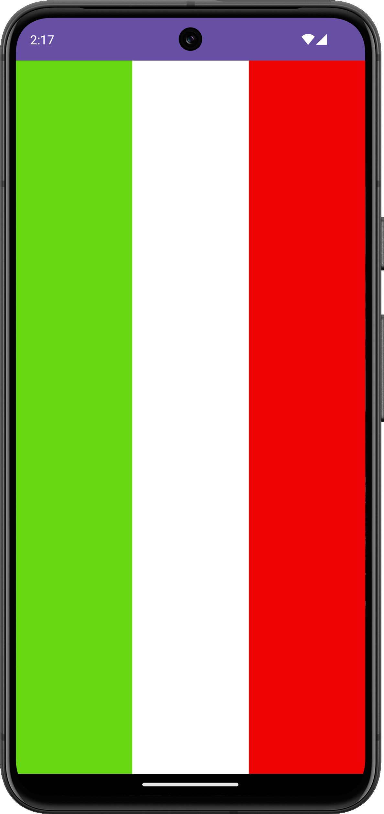
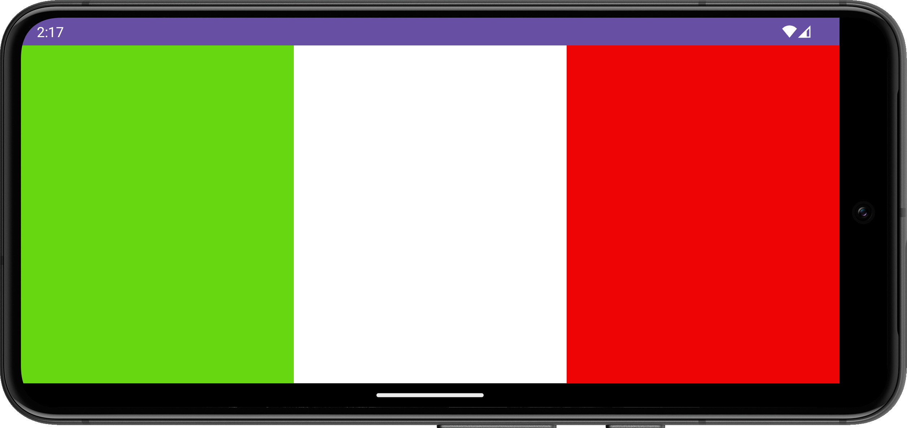

# Introduction à Android, mise en page 🤖

<Row>

<Column>

:::danger Avant la séance (2h)

- Regarder les vidéos de la semaine.
- Lisez la documentation standard d'**[Android](https://developer.android.com/index.html)** (max 20 minutes).

<Row>

<Column>

<Video url="https://youtu.be/5rBZ4P06usU" />

</Column>

<Column>

<Video url="https://youtu.be/x-dQ5Sa0Ns0" />

</Column>

</Row>

Video :

- refaire mise en page en kotlin

:::

</Column>

<Column>

:::info Pendant la séance

- Nous ferons quelques exemples d'applications pour revenir sur les éléments couverts dans la video.
  - Exécution et débogage.
  - Lancement sur émulateur ou tablette.
  - Utilisation de Snackbar et Log + filtres.
- Vous devez compléter les exercices de la semaine.
- Vous travaillerez sur le [travail 2](../tp/tp2).

:::

</Column>

</Row>

:::note Exercices

### Exercice Italia

Reproduire le drapeau de l'Italie avec 3 TextView de même taille.

<Row>

<Column size="4">

</Column>

<Column size="8">

</Column>

</Row>

### Exercice TapeLeLapin

Vous devez programmer le jeu de Tape Le Lapin.

- Au début du jeu, le lapin est sur une case
- Le joueur tape sur un bouton
  - S'il tape le lapin, on augmente le nombre de pafs et le lapin change de case. On affiche également un toast avec le texte POOF
  - S'il rate, on compte un flop mais le lapin reste où il est

<Row>

<Column size="6">

</Column>

<Column size="6">

</Column>

</Row>

:::
