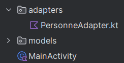

# RecyclerView - Objet

Étapes de mise en place d'un `RecyclerView` qui gère une liste d'objets sur un projet existant.

Le code de cette recette est disponible [ici](https://github.com/departement-info-cem/3N5-Prog3/tree/main/code/RecetteRecyclerViewObjet).

La liste que nous allons afficher est une liste de `Personne` :

<GHCode
  repo="3N5-Prog3"
  filePath="code/RecetteRecyclerViewObjet/app/src/main/java/org/depinfo/demorecyclerviewobjet/models/Personne.kt"
  startLine="3"
/>

<Tabs queryString="recette-objet">
  <TabItem value="build.gradle.kts" label="build.gradle.kts">

    Nous allons utiliser le [ViewBinding](https://developer.android.com/topic/libraries/view-binding#kts) pour la suite des choses. Assurez vous qu'il est activé dans votre fichier `build.gradle.kts`.

    ```kotlin
    android {
      ...
      buildFeatures {
        viewBinding = true
      }
    }
    ```

  </TabItem>
  <TabItem value="personne_item.xml" label="personne_itemn.xml">
    L'interface graphique de chaque item à afficher dans la liste est définie dans un fichier `xml`, comme c'est le cas pour les fichiers `xml` qui sont utilisés pour définir l'interface graphique.

    <Row>

    <Column size="7" >

    Dans l'explorateur de projet, créez un nouveau fichier `Layout Resource File` dans le dossier `res/layout`.

    

    </Column>

    <Column size="5" >

    Nommez le fichier `personne_item.xml`. Dans `Root element`, choisissez `LinearLayout`.

    

    </Column>

    </Row>

    Il faudra personnaliser votre fichier en fonction de ce que vous voulez afficher sur chaque élément de liste.

    - Assignez des `id` aux éléments avec lesquels vous allez interagir.
    - Attention à la hauteur de chaque élément. Ils doivent tous avoir une hauteur fixe ou une hauteur définie en fonction de leur contenu (`wrap_content`).

    Voici un exemple de fichier `personne_item.xml` si on souhaite afficher les différents champs de la classe `Personne` dans différents `TextView` :

    <GHCode
      repo="3N5-Prog3"
      filePath="code/RecetteRecyclerViewObjet/app/src/main/res/layout/personne_item.xml"
    />

  </TabItem>
  <TabItem value="Personne.kt" label="Personne.kt">
  
      Créez une classe `Personne` dans un package `models` que vous devez aussi créer dans votre projet.
  
      
  
      <GHCode
        repo="3N5-Prog3"
        filePath="code/RecetteRecyclerViewObjet/app/src/main/java/org/depinfo/demorecyclerviewobjet/models/Personne.kt"
        startLine="3"
      />
      
  </TabItem>
  <TabItem value="PersonneAdapter.kt" label="PersonneAdapter.kt">

    Vous allez créer une classe qui est responsable de la gestion de **TOUT** les éléments de la liste et de leur mise à jour.
    En Android, ce type est classe est appelée un **[Adapter](https://developer.android.com/reference/kotlin/android/widget/Adapter)**.

    Créez une nouvelle classe `PersonneAdapter.kt` dans un package `adapters` que vous devez aussi créer dans votre projet.

    

    <details>
      <summary>ViewHolder</summary>

      Dans la classe `PersonneAdapter`, vous devez définir une classe interne, qui sera responsable de gérer le contenu affiché dans **UN SEUL** élément de la liste.
      Cette classe est appelée un **[ViewHolder](https://developer.android.com/reference/kotlin/androidx/recyclerview/widget/RecyclerView.ViewHolder)**.
      Cette classe ressemble en quelque sorte à une classe d'**Activité**.

      <GHCode
        repo="3N5-Prog3"
        filePath="code/RecetteRecyclerViewObjet/app/src/main/java/org/depinfo/demorecyclerviewobjet/adapters/PersonneAdapter.kt"
        startLine="11"
        ignore="11:22-11:112,23-31,33-45"
      />

    </details>

    <details>
      <summary>DiffCallback</summary>

      Pour que l'`Adapter` sache quels éléments d'une liste doivent être affichés lorsqu'on la modifie, on doit définir un objet qui implémente la classe abstraite **[DiffUtil.ItemCallback](https://developer.android.com/reference/androidx/recyclerview/widget/DiffUtil.ItemCallback)**.

      Nous vous recommandons de définir cet objet dans le même fichier que votre `Adapter`, mais à l'extérieur de la classe `PersonneAdapter`.

      <GHCode
        repo="3N5-Prog3"
        filePath="code/RecetteRecyclerViewObjet/app/src/main/java/org/depinfo/demorecyclerviewobjet/adapters/PersonneAdapter.kt"
        startLine="11"
        ignore="11:22-11:112,13-31-    // Reste du code..."
      />

    </details>

    <details>
      <summary>ListAdapter</summary>

      Afin d'accéder aux outils de gestion de liste fournis par Android, vous devez étendre la classe **[ListAdapter](https://developer.android.com/reference/androidx/recyclerview/widget/ListAdapter)**.

      La classe a besoin du **ViewHolder** et du **DiffCallback** que vous avez défini précédemment.

      <GHCode
        repo="3N5-Prog3"
        filePath="code/RecetteRecyclerViewObjet/app/src/main/java/org/depinfo/demorecyclerviewobjet/adapters/PersonneAdapter.kt"
        startLine="11"
        ignore="12-31-    // Reste du code...,33-45"
      />

      À ce point ci, votre environnement de développement devrait vous indiquer des erreurs.
      C'est normal, car vous n'avez pas encore implémenté les méthodes requises par la classe ListAdapter.

      Pour corriger cette erreur, vous pouvez placer votre curseur sur l'erreur, et cliquer sur "Implement members", qui va générer les méthodes.
      Dans la prochaine étape, nous allons remplir ces méthodes.

      
    </details>

    <details>
      <summary>onCreateViewHolder</summary>

      La méthode `onCreateViewHolder` est appelée lorsqu'un nouvel élément de la liste doit être affiché.

      <GHCode
        repo="3N5-Prog3"
        filePath="code/RecetteRecyclerViewObjet/app/src/main/java/org/depinfo/demorecyclerviewobjet/adapters/PersonneAdapter.kt"
        startLine="24"
        endLine="27"
      />
    </details>

    <details>
      <summary>onBindViewHolder</summary>

      La méthode `onBindViewHolder` est appelée lorsqu'un élément de la liste doit être mis à jour.

      <GHCode
        repo="3N5-Prog3"
        filePath="code/RecetteRecyclerViewObjet/app/src/main/java/org/depinfo/demorecyclerviewobjet/adapters/PersonneAdapter.kt"
        startLine="29"
        endLine="31"
      />
    </details>

    <details>
      <summary>Résultat</summary>

      Votre fichier PersonneAdapter.kt devrait maintenant ressembler à ceci :

      <GHCode
        repo="3N5-Prog3"
        filePath="code/RecetteRecyclerViewObjet/app/src/main/java/org/depinfo/demorecyclerviewobjet/adapters/PersonneAdapter.kt"
        startLine="11"
      />
    </details>

  </TabItem>
  <TabItem value="ActivityMain.xml" label="ActivityMain.xml">

    On ajoute le `RecyclerView` dans le fichier `xml` de l'activité.

    <GHCode
      repo="3N5-Prog3"
      filePath="code/RecetteRecyclerViewObjet/app/src/main/res/layout/activity_main.xml"
    />

  </TabItem>
  <TabItem value="MainActivity.kt" label="MainActivity.kt">

    <details>
      <summary>ViewBinding</summary>

      Commencez par mettre en place le ViewBinding dans votre activité.

      <GHCode
        repo="3N5-Prog3"
        filePath="code/RecetteRecyclerViewObjet/app/src/main/java/org/depinfo/demorecyclerviewobjet/MainActivity.kt"
        startLine="13"
        ignore="16-16,22-24,27-50"
      />
    </details>

    <details>
      <summary>Configurer le RecyclerView</summary>

      Créez une méthode pour lier l'`Adapteur` que nous venons de créer au `RecyclerView`.

      <GHCode
        repo="3N5-Prog3"
        filePath="code/RecetteRecyclerViewObjet/app/src/main/java/org/depinfo/demorecyclerviewobjet/MainActivity.kt"
        startLine="13"
        ignore="19-21-        // Reste du code...,24-24,37-50"
      />
      
    </details>

    <details>
      <summary>Remplir le RecyclerView</summary>

      Remplissez le recycler view avec 10 000 éléments.

      <GHCode
        repo="3N5-Prog3"
        filePath="code/RecetteRecyclerViewObjet/app/src/main/java/org/depinfo/demorecyclerviewobjet/MainActivity.kt"
        startLine="13"
        ignore="19-21-        // Reste du code...,27-36-    // Reste du code"
      />

    </details>

  </TabItem>
</Tabs>
