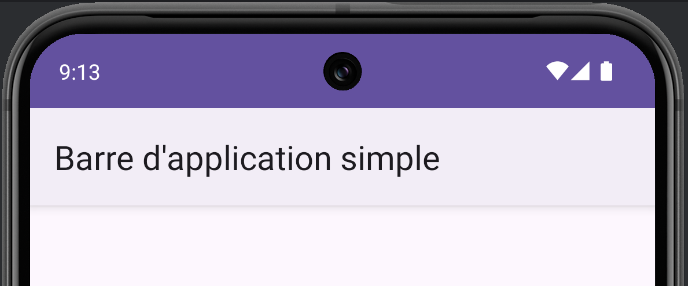

# Barre d'application - Simple

<Row>

    <Column size="6">

        Cet barre d'application permet d'afficher une barre simple en haut de l'écran.

        Il est possible de :

        - Changer le titre de la barre
        - Ajouter des options de menu

        Il n'est pas possible de :

        - Ajouter un menu hamburger

        Pour une barre d'application plus complète, veuillez vous référer à TODO inclure le lien vers la barre d'application complexe.

    </Column>

    <Column size="6">

        

    </Column>

</Row>

## Activer la barre d'application

Par défaut cette barre n'est pas affichée. 

Pour l'activer, il faut :

1. naviguer dans `res/values/themes`, et modifier les 2 fichiers nommés `themes.xml`.
2. Effacer tout les endroits où on peut lire `.NoActionBar`. Par exemple, `Theme.Material3.DayNight.NoActionBar` devient `Theme.Material3.DayNight`

## Changer le titre

Une fois que la barre d'application est activé, il est possible de changer le texte qui s'y affiche.

Dans le `onCreate` de votre activité, faire comme suit :

```kotlin
class AccueilActivity : AppCompatActivity() {
    override fun onCreate(savedInstanceState: Bundle?) {
        
        // Reste du code...

        title = "Accueil"
    }
}
```

## Ajouter un menu

Référez-vous à la recette sur les [menus](./menu) pour plus de détails.
