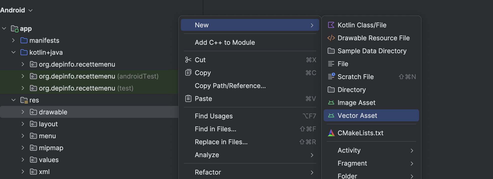
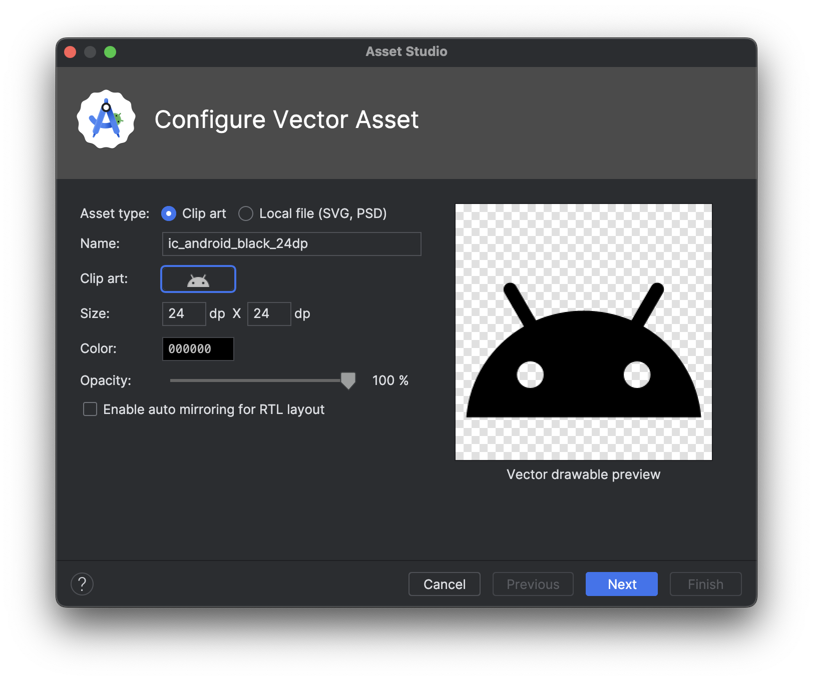

# Icônes

<Row>

<Column>

Il est possible d'utiliser des icônes un peu partout dans votre application Android. 
Que ce soit pour les boutons, les menus, les notifications, etc. 
Les icônes sont des images qui sont généralement utilisées pour représenter des actions ou des éléments de l'interface utilisateur.

</Column>

<Column size="1" >

</Column>

<Column size="1" >

</Column>

</Row>

## Ajouter des icônes

Par défaut, Android offre une banque d'icônes que vous pouvez utiliser. Il faut cependant les ajouter manuellement à votre projet.

- Explorez les différentes options. 
- La plus intéressante étant **"Clip Art"** qui vous permet de choisir parmi une grande variété d'icônes.
- Nous vous recommandons de ne pas trop toucher au champ **"Name"** qui est généré pour vous.

