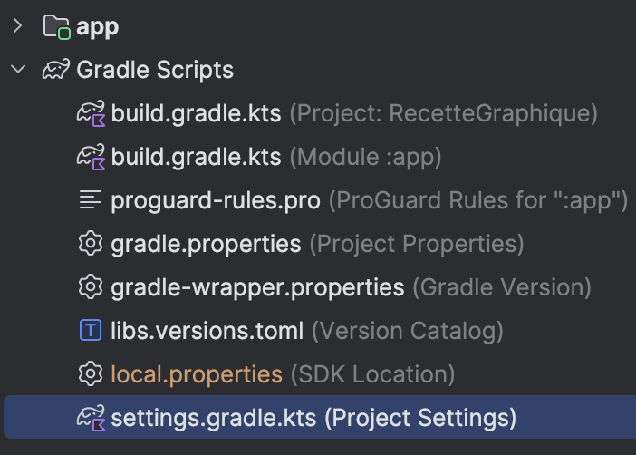

# Jitpack

Jitpack est une plateforme qui permet de construire, de publier, et d'importer des projets Java sur GitHub.
Dans notre cas, nous allons nous en servir pour importer des librairies tierces hébergées sur GitHub.

<Tabs queryString="recette-jitpack">
    <TabItem value="settings.gradle.kts" label="settings.gradle.kts">

        Ouvrez le fichier `settings.gradle.kts` de votre projet.

        <Row>

            <Column size="4">

            

            </Column>

            <Column size="8"></Column>

        </Row>

        Sous `dependencyResolutionManagement > repositories`, ajoutez `maven { setUrl("https://jitpack.io") }`

        ```kotlin
        dependencyResolutionManagement {
            // Autres options...
            repositories {
                // Autres repositories...
                maven { setUrl("https://jitpack.io") } // Ajout de Jitpack
            }
        }
        ````

    </TabItem>
    <TabItem value="build.gradle.kts" label="build.gradle.kts">

        Vous pouvez maintenant importer la librairie de votre choix dans le fichier `build.gradle.kts` de votre module.

        ```kotlin
        dependencies {
            // Autres imports...
            // Ce n'est pas la même libraire qui est requise pour le TP2. 
            // Vous devrez faire un peu de recherche de votre côté!
            implementation("com.github.FabianTerhorst:Isometric:a5b833e1945d8194141ab68d8a0c4b8bff1ff40c")
        }
        ```

    </TabItem>

</Tabs>