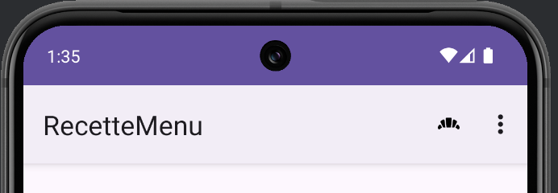
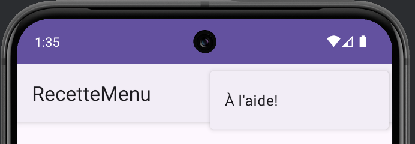
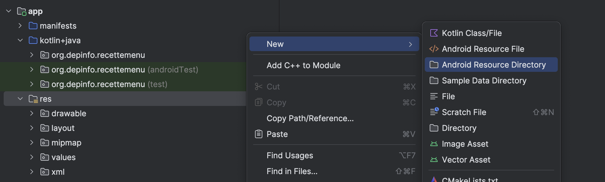
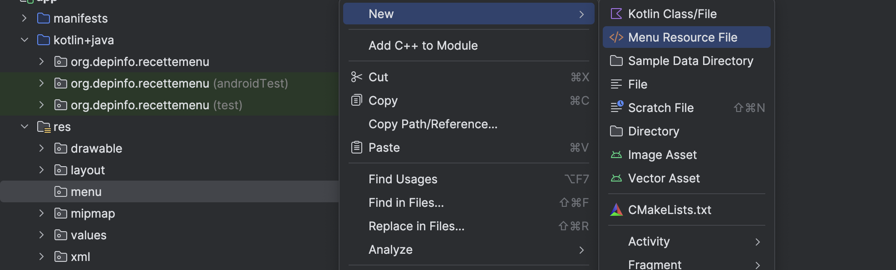

# Menu - Barre d'application

Un menu permet d'afficher une liste de choix rapides partir d'une barre d'application.

<Row>

<Column>

</Column>

<Column>

</Column>

</Row>

Le code de cette recette est disponible [ici](https://github.com/departement-info-cem/3N5-Prog3/tree/main/code/RecetteMenu).

<Tabs queryString="recette-menu">
  <TabItem value="preambule" label="Préambule">

    Assurez vous d'activer la barre d'application en suivant les étapes de la recette [Barre d'application - Simple](/recettes/app-bar).

  </TabItem>
  <TabItem value="mon_menu.xml" label="mon_menu.xml">

    Ce fichier sert à définir les éléments du menu.

    Par défaut, un projet Android ne possède pas la structure pour gérer un menu. Il faut donc la créer.

    Ajouter un dossier `menu` dans le dossier `res` de votre projet.

    

    - Directory name : `menu`
    - Resource type : `menu`

    

    Nous pouvons maintenant ajouter le fichier `mon_menu.xml` dans ce dossier.

    

    Voici un exemple de fichier `mon_menu.xml` :

    <GHCode
      repo="3N5-Prog3"
      filePath="code/RecetteMenu/app/src/main/res/menu/mon_menu.xml"
    />

    Pour plus de détails sur les possibilités de personnalisation, consultez la [documentation officielle](https://developer.android.com/guide/topics/ui/menus).

:::tip Icônes

Pour voir comment ajouter des icônes dans vos projets, réferez vous à la recette des [Icônes](/recettes/icones).

:::

  </TabItem>
    <TabItem value="MainActivity.kt" label="MainActivity.kt">

      <GHCode
        repo="3N5-Prog3"
        filePath="code/RecetteMenu/app/src/main/java/org/depinfo/recettemenu/MainActivity.kt"
        startLine="12"
      />

  </TabItem>
</Tabs>