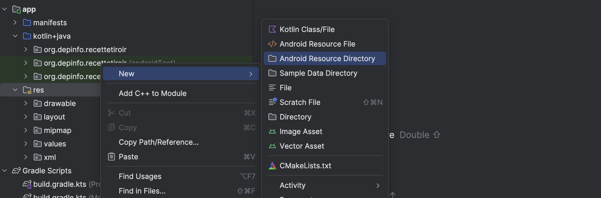
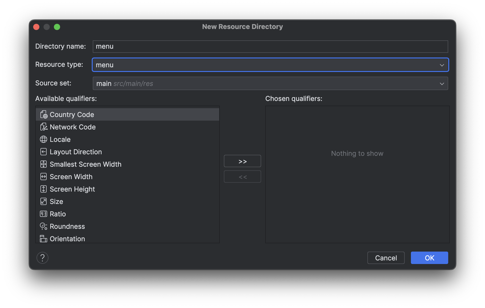
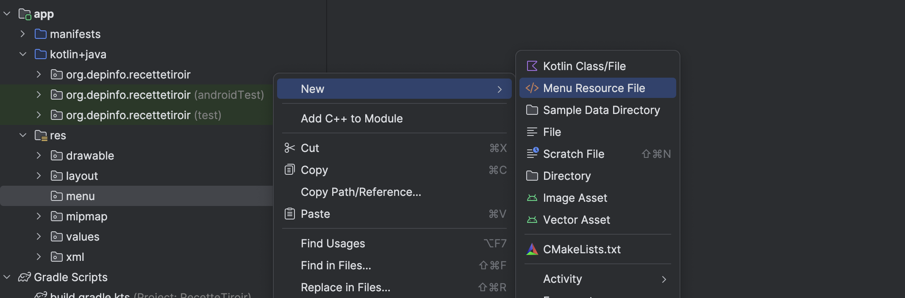

# Tiroir de navigation

Le code de cette recette est disponible [ici](https://github.com/departement-info-cem/3N5-Prog3/tree/main/code/RecetteTiroir).

<Tabs queryString="recette-menu">
  <TabItem value="preambule" label="Préambule">

    Assurez vous d'activer la barre d'application en suivant les étapes de la recette [Barre d'application - Simple](/recettes/app-bar-simple).

  </TabItem>
  <TabItem value="tiroir.xml" label="tiroir.xml">

    Ce fichier sert à définir les éléments du tiroir.

    Par défaut, un projet Android ne possède pas la structure pour gérer un menu. Il faut donc la créer.

    Ajouter un dossier `menu` dans le dossier `res` de votre projet.

    

    - Directory name : `menu`
    - Resource type : `menu`

    

    Nous pouvons maintenant ajouter le fichier `tiroir.xml` dans ce dossier.

    

    Voici un exemple de fichier `tiroir.xml` :

    <GHCode
      repo="3N5-Prog3"
      filePath="code/RecetteTiroir/app/src/main/res/menu/tiroir.xml"
    />

:::tip Icônes

Pour voir comment ajouter des icônes dans vos projets, réferez vous à la recette des [Icônes](/recettes/icones).

:::

</TabItem>
<TabItem value="activity_main.xml" label="activity_main.xml">

    Voici un exemple de fichier `activity_main.xml` :

    <GHCode
      repo="3N5-Prog3"
      filePath="code/RecetteTiroir/app/src/main/res/layout/activity_main.xml"
    />

</TabItem>

</Tabs>